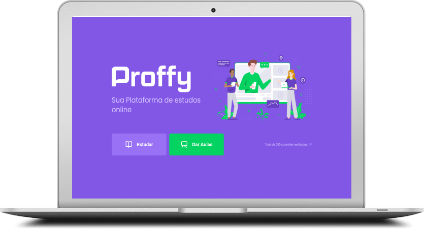
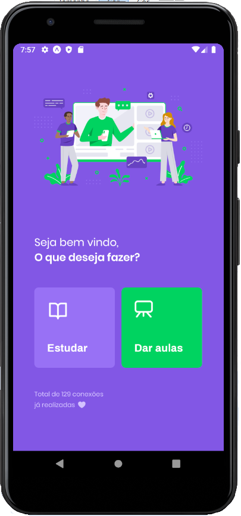

<h1 align="center">
  
</h1>

<br/>

<p align="center">
  Um projeto desenvolvido na NLW(Next Level Week), Rocketseat.
</p>

<h2 align="center">
  
  
</h2>

<br/>

# Resumo do Projeto

Uma plataforma online para que alunos encontrem professores. Para o aluno, o projeto oferece uma lista de professores cadastrados, que pode ser filtrada por **matéria, dia da semana e horário disponível**. Já para o professor é oferecido um formulário de inscrição, para que assim seja adicionado a listagem de proffys disponíveis.

<h1 align="center">
  
</h1>


# Como rodar a aplicação

```
# Clone do repositório
Faça o clone da aplicação
$ git clone https://github.com/FilipeDiasLima/Proffy.git
```

## Rodando o server/API

```
# Navegue até a pasta server
$ cd Proffy/server

# Instale as dependencias
$ yarn

# Execute o comando
$ yarn start
```

## Rodando o projeto web

```
# Navegue até a pasta server
$ cd Proffy/web

# Instale as dependencias
$ yarn

# Execute o comando
$ yarn start
```

## Rodando o projeto mobile

```
# Para rodar aplicação mobile, será necessário o EXPO

# Navegue até a pasta server
$ cd Proffy/mobile

# Instale as dependencias
$ yarn

# Execute o comando
$ expo start
```
